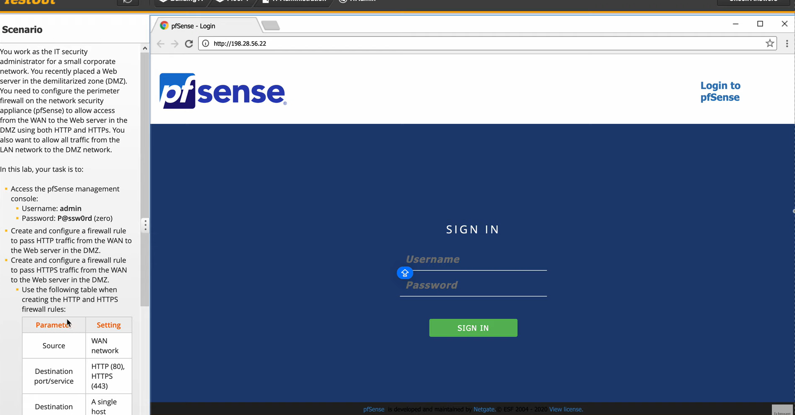
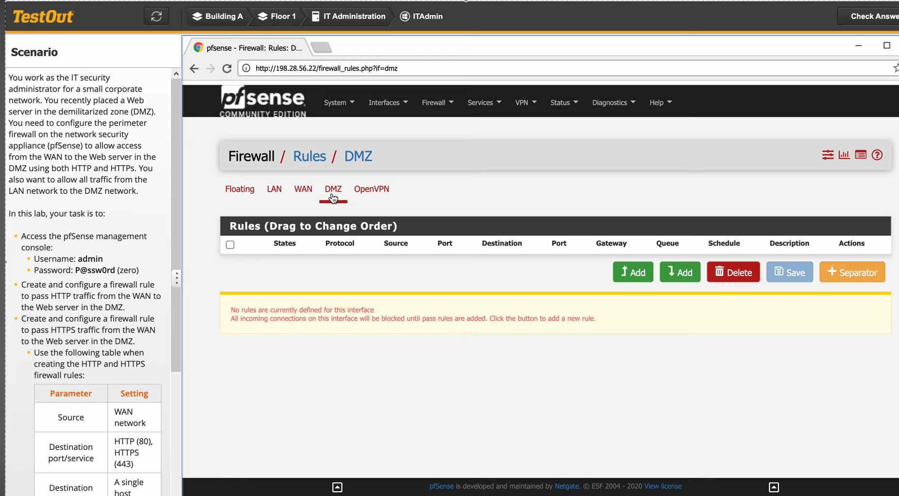
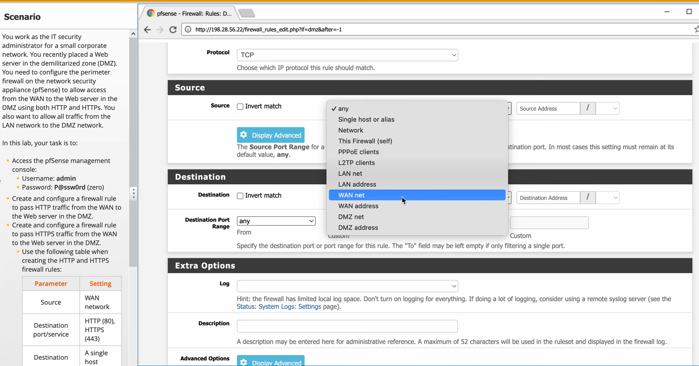
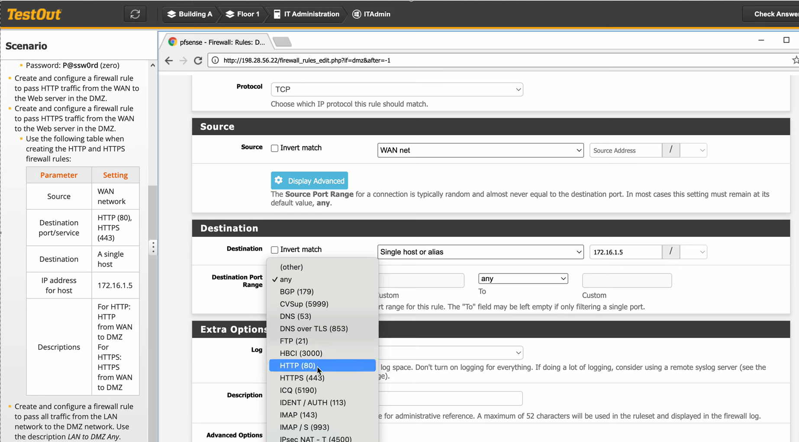
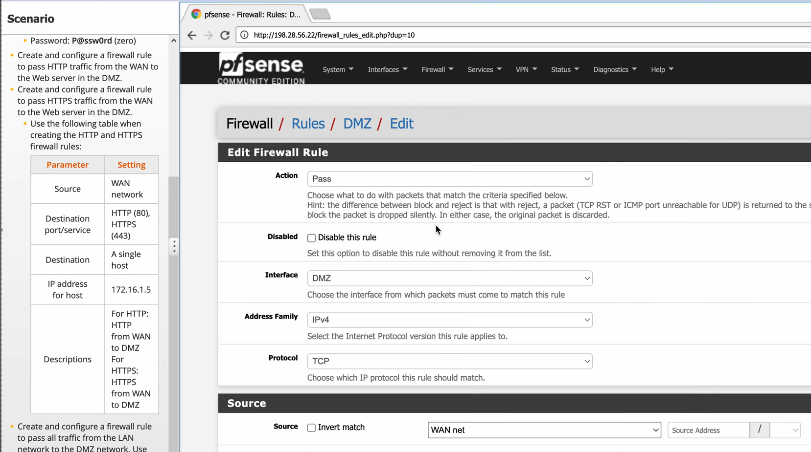
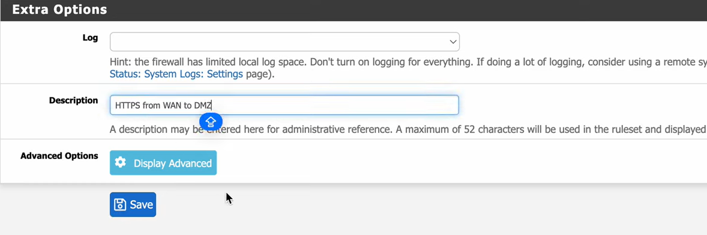
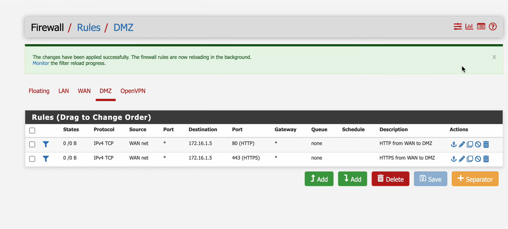
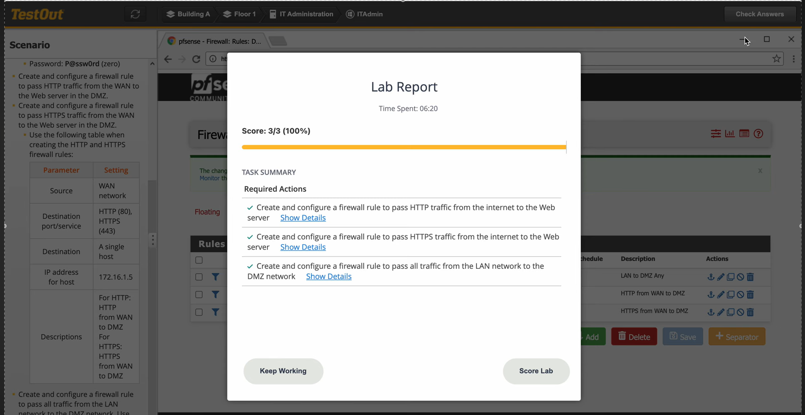

# 5.4.5 Configure a Perimeter Firewall

+ ในฐานะผู้ดูแลระบบรักษาความปลอดภัยด้านไอทีขององค์กรขนาดเล็ก คุณต้องกำหนดค่า Perimeter Firewall บน Edge Router เพื่อควบคุมการรับส่งข้อมูลระหว่างเครือข่ายภายใน (Inside) และเครือข่ายภายนอก (Outside) โดยการสร้าง Extended ACL เพื่ออนุญาตหรือบล็อกการเชื่อมต่อที่ระบุ
+ วัตถุประสงค์ของการปฏิบัติในห้องปฏิบัติการนี้ มีดังนี้:
    + กำหนดค่า Extended ACL บน Edge Router โดยใช้ข้อมูลดังต่อไปนี้

# วิธีเข้าถึง: Packet Tracer > Edge-Router > CLI

| Parameter | Value |
| :--- | :--- |
| **Router** | Edge-Router |
| **ACL Name/Number** | 101 |
| **Inside Interface** | GigabitEthernet0/1 |
| **Outside Interface** | GigabitEthernet0/0 |
| **Permitted Traffic** | TCP, HTTP, HTTPS, DNS |
| **Blocked Traffic** | All other inbound traffic |

+ สร้าง Extended ACL เพื่อบล็อก Traffic ที่ไม่ได้รับอนุญาตจากภายนอก
+ Apply ACL บน Interface Outside (GigabitEthernet0/0) ทิศทาง inbound
+ ยืนยันว่า ACL ถูกสร้างและทำงานเรียบร้อยแล้ว

# Start Lab

  + 1.เปิด Cisco Packet Tracer แล้วตรวจสอบ Topology ของเครือข่าย

  

  + 2.คลิกที่ Edge-Router แล้วเลือกแท็บ CLI เพื่อเข้าสู่ Command Line Interface

  

  + 3.พิมพ์คำสั่ง `enable` และ `configure terminal` เพื่อเข้าสู่โหมด Global Configuration

  

  + 4.สร้าง Extended ACL หมายเลข 101 โดยพิมพ์คำสั่ง `access-list 101` พร้อมกำหนดเงื่อนไข permit และ deny

  

  + 5.Apply ACL บน Interface GigabitEthernet0/0 ทิศทาง inbound ด้วยคำสั่ง `ip access-group 101 in`

  

  + 6.ตรวจสอบ ACL ที่สร้างด้วยคำสั่ง `show access-lists`

  

  + 7.ทดสอบการเชื่อมต่อจาก PC ภายนอก ไปยัง Server ภายใน เพื่อยืนยันว่า ACL ทำงานถูกต้อง

  

  + 8.กด Score Lab เพื่อตรวจสอบผลและสิ้นสุด Lab 5.4.5 Configure a Perimeter Firewall

  
