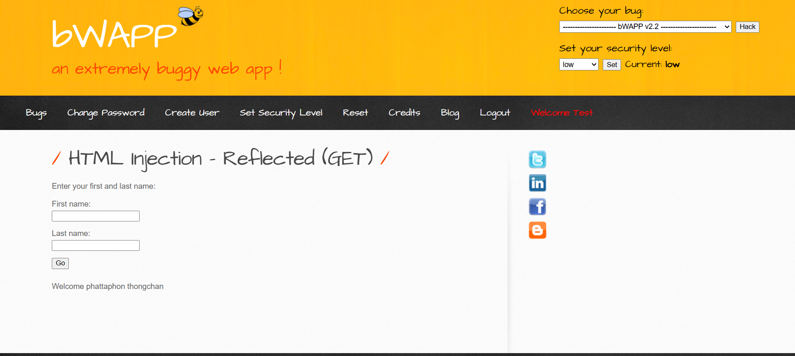
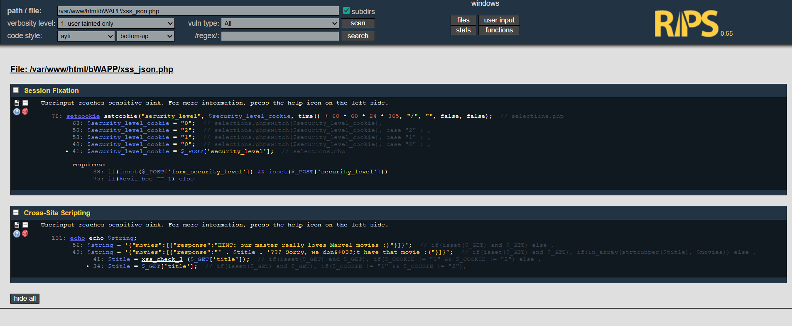
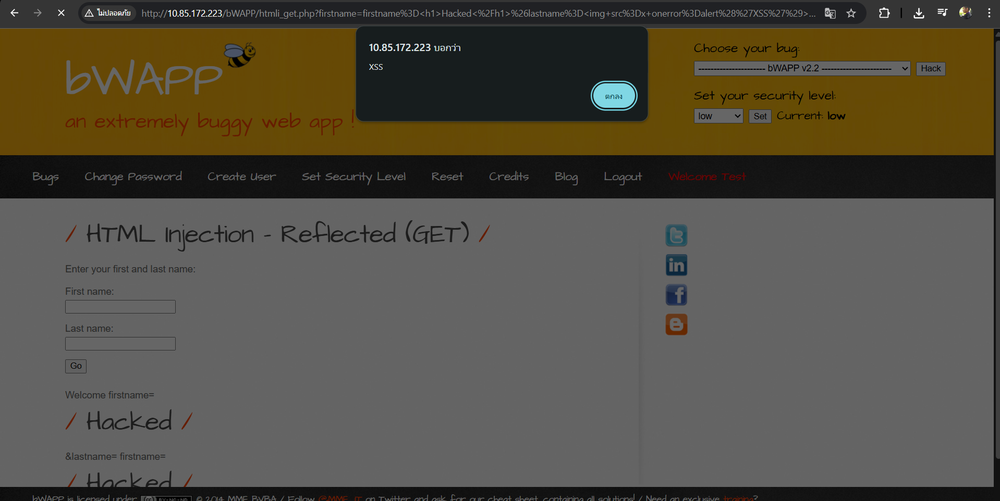
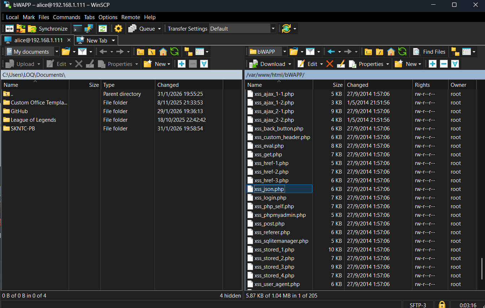
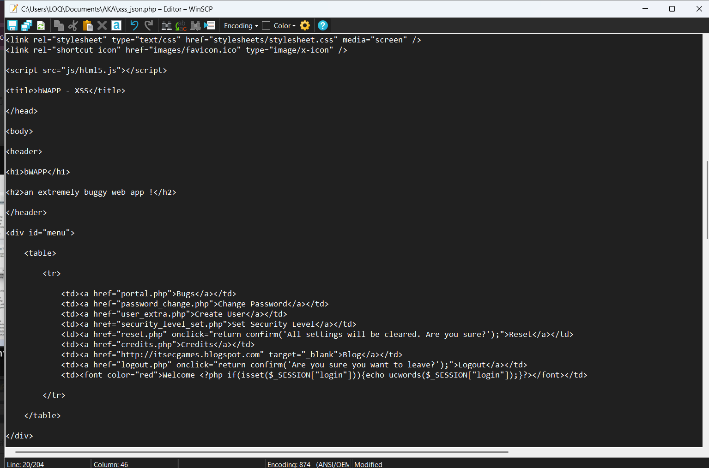
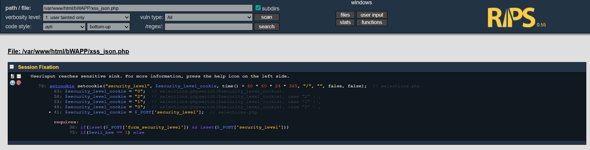
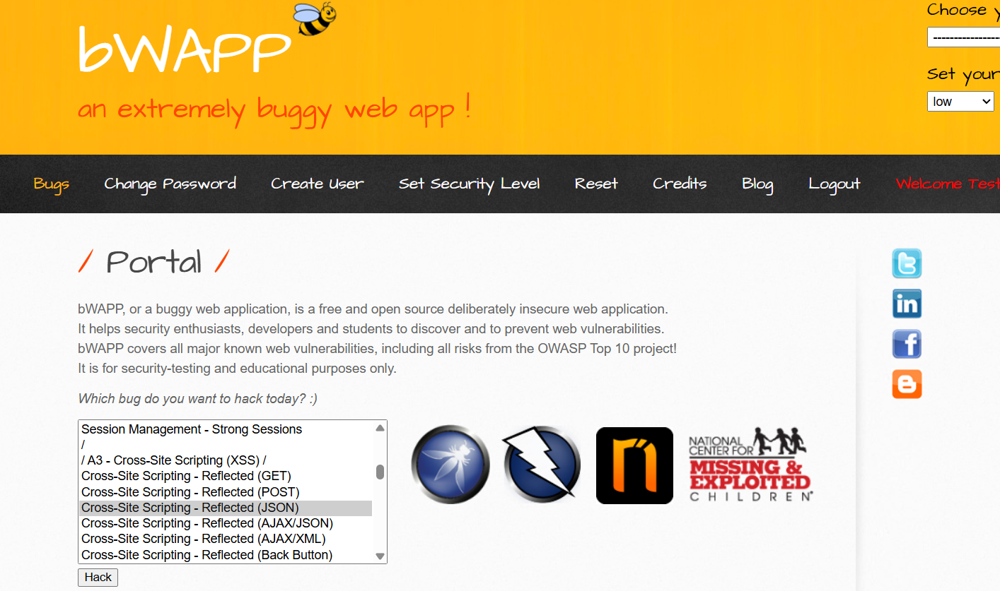
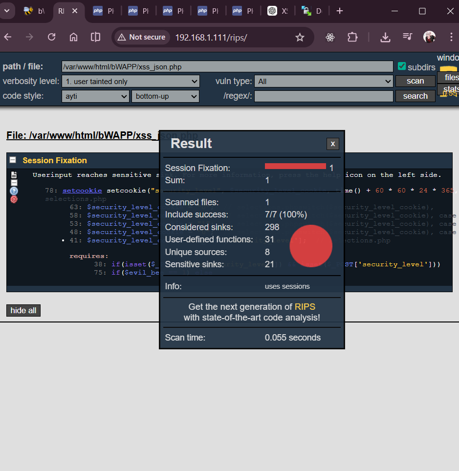
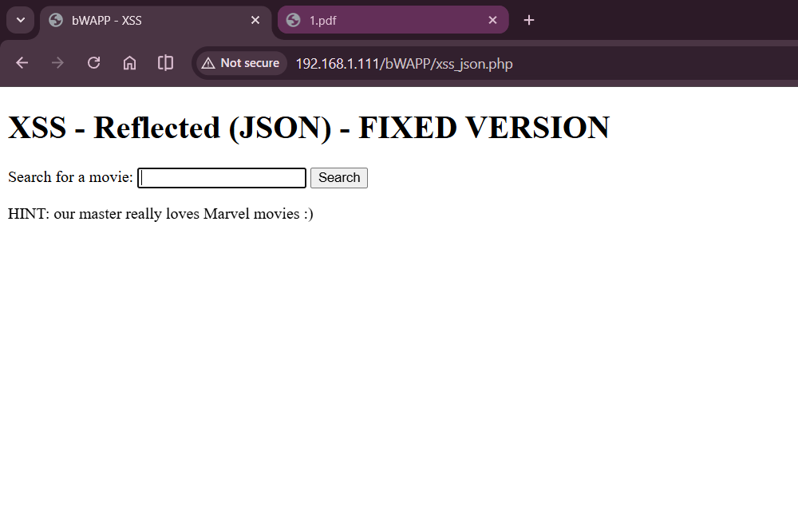
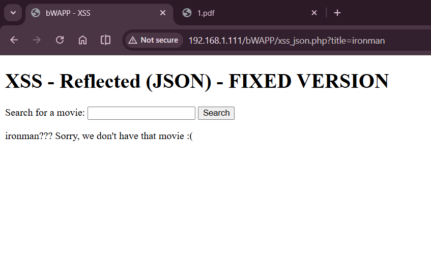

# การจัดการช่องโหว่ Cross-Site Scripting (XSS)

[⬅ ย้อนกลับ](README.md)

**เป้าหมาย:** ไฟล์ `index.php` ในระบบ PHP Web Application  
**ระดับความเสี่ยง:** สูง (High Risk)  



---

## 1. ฟังก์ชันการทำงานเดิม (Business Function)
หน้าเว็บมีหน้าที่รับค่าชื่อจากผู้ใช้ผ่านพารามิเตอร์ `name` ใน URL (`$_GET["name"]`) และนำมาแสดงผลเป็นข้อความต้อนรับบนหน้าเว็บผ่านคำสั่ง `print` หรือ `echo`
**สิ่งที่ควรจะเป็น:** ระบบควรแสดงชื่อผู้ใช้เป็นข้อความธรรมดาเท่านั้น โดยไม่อนุญาตให้โค้ด (HTML/JavaScript) ทำงาน

## 2. ช่องโหว่และการทดสอบ (Vulnerability & Payload)
### ปัญหาที่พบ (Root Cause Analysis)
จากการตรวจสอบโค้ดการทำงานของระบบ (และยืนยันด้วยเครื่องมือ RIPS) พบการนำข้อมูลที่ผู้ใช้ควบคุมได้ (Untrusted Input) ไปแสดงผลทันทีโดยไม่มีการกรอง (Filter) หรือการแปลงอักขระ (Encode)
- **Source:** `$_GET["name"]`
- **Sink:** `print()` หรือ `echo`

  


ลักษณะนี้เปิดโอกาสให้ผู้โจมตีฝังโค้ดอันตราย เช่น JavaScript ลงไปในหน้าเว็บ (XSS) ซึ่งอาจนำไปสู่ผลลัพธ์ที่ร้ายแรง ได้แก่:
- การขโมย Cookie หรือทำ Session Hijacking เพื่อสวมรอยเป็นผู้ใช้
- การสร้างหน้า Phishing บนโดเมนจริงเพื่อหลอกลวง
- การเปลี่ยนหน้าตาเว็บไซต์ (Defacement)

## 3. การพิสูจน์ช่องโหว่ (Exploitation)
**Payload ที่ใช้ทดสอบ:**
```html
/index.php?name=<script>alert(1)</script>
```
**ผลลัพธ์:** เมื่อเข้า URL ดังกล่าว Browser จะประมวลผลแท็ก `<script>` เป็นโค้ดจริง และแสดง Popup Alert ขึ้นมา เป็นการยืนยันว่าสามารถโจมตีช่องโหว่ XSS ได้สำเร็จ

## 4. แนวทางการแก้ไข (Remediation)
**หลักการความปลอดภัย:** "ห้ามนำข้อมูลจากผู้ใช้ไปแสดงผลตรง ๆ บนหน้าเว็บ ต้องทำการ Encode ก่อนเสมอ"

**วิธีการแก้ไข:**  
  
ทำการเปิดไฟล์บน Server (ผ่าน WinSCP) และแก้ไขโดยใช้ฟังก์ชัน `htmlentities()` เพื่อแปลงอักขระพิเศษ (เช่น `<`, `>`, `"`, `'`, `&`) ให้อยู่ในรูปของ HTML Entities ก่อนนำไปแสดงผล

**โค้ดที่ได้รับการแก้ไข:**
```php
print("Hello " . htmlentities($_GET["name"], ENT_QUOTES, "utf-8"));
```
  


**อธิบายการป้องกัน:**
- `htmlentities()`: ทำหน้าที่แปลงแท็ก HTML เป็น Entity ปลอดภัย (ป้องกัน Browser มองว่าเป็นโค้ด)
- `ENT_QUOTES`: ป้องกันการแทรกอักขระ Quote ทั้งแบบเดี่ยว (`'`) และแบบคู่ (`"`)
- `utf-8`: ระบุ Encoding ให้เป็น UTF-8 เพื่อป้องกันการ Bypass ช่องโหว่ผ่าน Character Encoding

## 5. การตรวจสอบหลังการแก้ไข (Verification)


1. **Security Check (ตรวจสอบความปลอดภัย):**  
   ทดสอบด้วย Payload เดิม `/index.php?name=<script>alert(1)</script>`  
     
   **ผลลัพธ์:** ระบบแสดงผลข้อความ Payload ออกมาเป็นตัวอักษรธรรมดา ไม่มีการรัน JavaScript อีกต่อไป

2. **Code Quality Check (ตรวจสอบคุณภาพโค้ดซ้ำ):**  
   สแกนโค้ดซ้ำด้วยเครื่องมือ RIPS  
     
   **ผลลัพธ์:** ไม่พบช่องโหว่เพิ่มเติม (No vulnerabilities found)

3. **Usability Check (ตรวจสอบการใช้งานปกติ):**  
     
   ทดสอบการเข้าลิงก์ปกติตามฟังก์ชันของระบบ  
     
   **ผลลัพธ์:** ระบบยังคงแสดงข้อความต้อนรับได้ถูกต้องตรงตาม Business Function ผู้ใช้งานทั่วไปสามารถใช้งานได้ตามปกติ

---

## 📌 สรุป
การแก้ไขช่องโหว่ Cross-Site Scripting (XSS) สามารถจัดการได้อย่างเด็ดขาดด้วยการทำ **Output Encoding** ก่อนแสดงผล โดยการใช้ `htmlentities()` ถือเป็น Best Practice ใน PHP สำหรับรับมือกับช่องโหว่นี้ ซึ่งส่งผลให้โค้ดอันตรายที่แนบมากับ Input ไม่สามารถถูกรันโดย Browser ได้ ช่วยลดความเสี่ยงจากการโจมตี มั่นใจถึงความปลอดภัยของระบบ และในขณะเดียวกัน ระบบยังคงพร้อมให้บริการ (Availability) ตามปกติ
