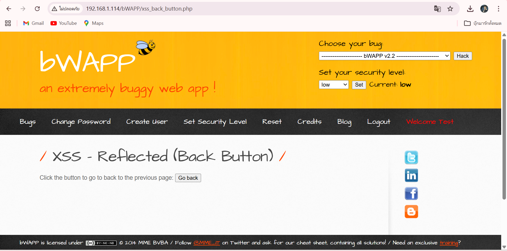
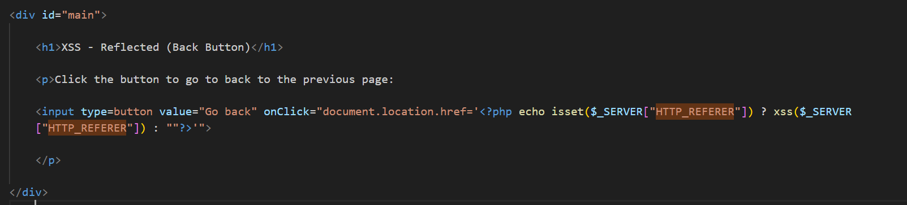
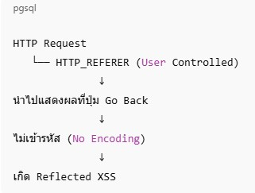
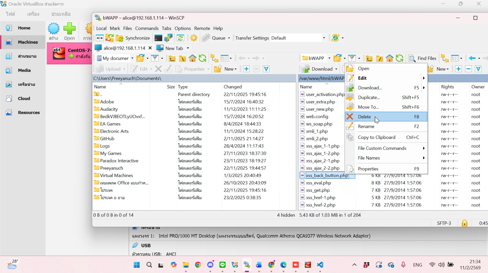
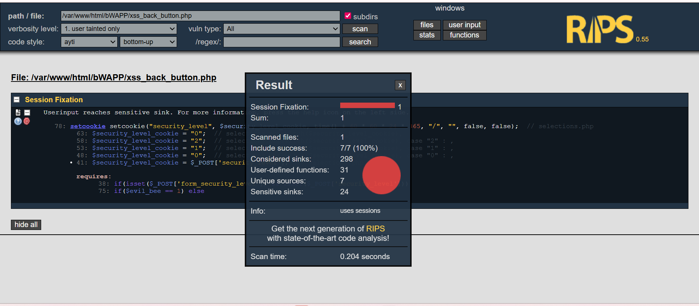

# รายงานการแก้ไขช่องโหว่ Cross-Site Scripting (XSS) แบบ Reflected

---

## 📋 Business Function — หน้านี้ทำงานอะไร?

หน้าเว็บนี้มีหน้าที่หลักเพียงอย่างเดียวคือ **แสดงปุ่ม "Go Back"** เพื่อให้ผู้ใช้กดแล้วย้อนกลับไปยังหน้าที่เคยเข้ามาก่อนหน้า  
เปรียบเหมือนกดปุ่ม **ลูกศรย้อนกลับ** บนเบราว์เซอร์ แต่แบบที่เขียนโค้ดควบคุมเอง

> ตัวอย่างการทำงานของโค้ดเดิม:
> - รับค่า URL ของหน้าที่ผู้ใช้มาจาก (Referer)
> - นำค่านั้นมาสร้างเป็นลิงก์ให้ปุ่ม Go Back กดแล้วพากลับไป



---

## ⚠️ ปัญหาที่พบ — ช่องโหว่ XSS คืออะไร?

**XSS (Cross-Site Scripting)** คือช่องโหว่ที่ทำให้ **คนร้ายสามารถแอบฝังโค้ด JavaScript อันตราย** เข้าไปในหน้าเว็บของเรา แล้วโค้ดนั้นจะถูกรันบนเบราว์เซอร์ของผู้ใช้คนอื่นที่เข้ามา  

ประเภทที่พบในกรณีนี้คือ **Reflected XSS** หมายความว่า โค้ดอันตรายจะ "สะท้อน" กลับมาทันทีในหน้าตอบสนอง โดยไม่ได้ถูกเก็บไว้ในฐานข้อมูล

**ความเสี่ยงที่อาจเกิดขึ้น:**
- ขโมย Cookie หรือ Session ของผู้ใช้ (เช่น ข้อมูล Login)
- หลอกให้ผู้ใช้เห็นหน้าปลอม (Phishing)
- รันคำสั่งต่างๆ บนเบราว์เซอร์โดยที่ผู้ใช้ไม่รู้ตัว





---

## 🔍 สาเหตุของปัญหา — ช่องโหว่อยู่ตรงไหน?

ช่องโหว่อยู่ที่ **ไฟล์ `xss_back_button.php`** ตรงส่วนโค้ดที่สร้างปุ่ม Go Back  

**ปัญหาหลัก:** โค้ดดึงค่า **`$_SERVER['HTTP_REFERER']`** มาใช้งานโดยตรงโดยไม่มีการกรองหรือเข้ารหัสข้อมูลก่อน

**`HTTP_REFERER`** คืออะไร?  
คือข้อมูลที่เบราว์เซอร์ส่งไปบอกเซิร์ฟเวอร์ว่า "ผู้ใช้คนนี้มาจากหน้าไหน" เช่น `https://example.com/login.php`  
**แต่ข้อมูลนี้คนร้ายสามารถปลอมแปลงได้ง่ายมาก!** เช่น เปลี่ยนค่าเป็น `<script>alert('XSS')</script>` แล้วส่งมา


**วิธีที่คนร้ายโจมตี:**
1. ใช้เครื่องมือดักจับ HTTP (เช่น BurpSuite, Proxy) แก้ไขค่า Referer Header
2. ใส่โค้ด JavaScript อันตรายเข้าไปแทนที่ URL ปกติ เช่น `<script>alert('XSS')</script>`
3. เมื่อเซิร์ฟเวอร์นำค่านั้นมาแสดงผลบนหน้าเว็บโดยไม่กรอง โค้ดจะถูกรันทันที

**การยืนยันด้วยเครื่องมือสแกน (RIPS):**  
เครื่องมือสแกนความปลอดภัย RIPS ตรวจพบและระบุตำแหน่งโค้ดที่มีช่องโหว่ได้ชัดเจน โดยแจ้งเตือนว่าบรรทัดไหนในไฟล์ที่นำค่าจาก `$_SERVER['HTTP_REFERER']` มาแสดงผลโดยไม่ผ่านการเข้ารหัส

---

## 📂 ไฟล์ที่ต้องแก้ไข

```
xss_back_button.php
```

---

## 🛠️ วิธีแก้ไขที่ถูกต้อง

### ขั้นตอนที่ 1 — ตรวจสอบผลการสแกนจาก RIPS

เปิดดูรายงานจาก RIPS กดที่รายละเอียดของช่องโหว่เพื่อดูว่า:
- อยู่ในไฟล์ไหน
- บรรทัดไหน
- ควรแก้ด้วยวิธีใด


---

### ขั้นตอนที่ 2 — เข้าถึงเซิร์ฟเวอร์ด้วย WinSCP

**WinSCP** คือโปรแกรมสำหรับโอนถ่ายไฟล์เข้า-ออกเซิร์ฟเวอร์อย่างปลอดภัย  

ขั้นตอน:
1. เปิดโปรแกรม WinSCP แล้วเชื่อมต่อเข้าสู่เซิร์ฟเวอร์
2. ไปยังโฟลเดอร์ของเว็บไซต์
3. ค้นหาและเปิดไฟล์ `xss_back_button.php`
4. ตรวจสอบว่าบรรทัดที่ RIPS แจ้งเตือนนั้น **ยังทำงานอยู่จริง** (ไม่ถูก Comment ปิดไว้)


---

### ขั้นตอนที่ 3 — เปิดไฟล์ด้วย Visual Studio Code

นำไฟล์มาเปิดใน VS Code เพื่อวิเคราะห์โค้ดและเตรียมแก้ไข  
ตรวจสอบตำแหน่งที่แน่ชัดว่าโค้ดส่วนไหนดึงค่า `HTTP_REFERER` มาใช้งาน


---

## ✏️ แก้ไขจุดปัญหา — เปรียบเทียบก่อน/หลัง

### 🔴 ก่อนแก้ไข (โค้ดเก่า — มีช่องโหว่)

โค้ดเดิมดึงค่า `$_SERVER['HTTP_REFERER']` จากฝั่งเซิร์ฟเวอร์ PHP มาแสดงผลหรือใส่ใน JavaScript โดยตรง โดยไม่มีการกรองข้อมูลใดๆ ทำให้คนร้ายสามารถแก้ไขค่านี้แล้วฝังโค้ดอันตรายได้


---

### 🟢 หลังแก้ไข (โค้ดใหม่ — ปลอดภัย)

เปลี่ยนมาใช้ **`document.referrer`** ซึ่งเป็นคำสั่ง JavaScript ฝั่งเบราว์เซอร์แทน

**ทำไมถึงปลอดภัยกว่า?**
- `document.referrer` ดึงข้อมูลจากเบราว์เซอร์โดยตรง ไม่ผ่านเซิร์ฟเวอร์ PHP จึงไม่สามารถถูกแก้ไขผ่าน HTTP Header ได้
- มีการเพิ่มเงื่อนไขป้องกันไว้ด้วย:
  - ✅ **ถ้ามาจากหน้าอื่นจริงๆ (มีค่า referrer)** → ย้อนกลับไปหน้านั้นได้ตามปกติ
  - ✅ **ถ้าเปิดมาตรงๆ หรือค่าว่าง** → พาไปที่หน้าหลัก `portal.php` ทันที


---

## 📤 อัปโหลดไฟล์ที่แก้ไขแล้ว

ก่อนทำการแทนที่ไฟล์ในเซิร์ฟเวอร์ ต้องทำขั้นตอนเหล่านี้ก่อน:

> ⚠️ **สำคัญ:** ต้อง **สำรองข้อมูล (Backup)** ไฟล์เดิมไว้ในโฟลเดอร์อื่นเสมอ ก่อนที่จะลบหรือแทนที่ไฟล์ในเซิร์ฟเวอร์ เผื่อเกิดปัญหาจะได้เรียกคืนได้

1. บันทึก (Save) ไฟล์ที่แก้ไขแล้วในเครื่อง
2. คัดลอกไฟล์เดิมในเซิร์ฟเวอร์ไปเก็บใน Backup Folder
3. อัปโหลดไฟล์ใหม่ที่แก้ไขแล้วไปแทนที่




---

## ✅ ยืนยันผลการแก้ไข

### สแกนซ้ำด้วย RIPS

หลังจากอัปโหลดไฟล์แก้ไขแล้ว ให้รันการสแกนด้วย RIPS อีกครั้งเพื่อยืนยันว่าช่องโหว่หายไปจริง  
จำนวนช่องโหว่ที่ RIPS รายงาน **ลดลง** — ยืนยันว่าการแก้ไขสำเร็จ



---

### ทดสอบการใช้งานจริง

| สถานการณ์ | ก่อนแก้ไข | หลังแก้ไข |
|---|---|---|
| กดปุ่ม **Go Back** | ❌ อาจเกิด XSS / ใช้งานผิดปกติ | ✅ ย้อนกลับได้ปกติและปลอดภัย |
| เปิดหน้าตรงๆ (ไม่มี Referer) | ❌ อาจเกิด Error หรือ Redirect ผิดที่ | ✅ พาไปหน้า `portal.php` อัตโนมัติ |
| ระบบ DNS Lookup ในหน้า | ✅ ใช้งานได้ปกติ | ✅ ยังใช้งานได้ปกติ (ไม่กระทบ) |


---

## 📊 ผลลัพธ์สุดท้าย

หลังจากทำการแก้ไขโค้ดและอัปโหลดไฟล์ใหม่เรียบร้อยแล้ว สรุปผลได้ดังนี้:

**ด้านความปลอดภัย:**
- ✅ ช่องโหว่ Reflected XSS ถูกปิดสำเร็จ
- ✅ ไม่สามารถฝังโค้ด JavaScript อันตรายผ่าน Referer Header ได้อีกต่อไป
- ✅ RIPS ยืนยันว่าจำนวนช่องโหว่ลดลงแล้ว

**ด้านการใช้งาน (Business Function):**
- ✅ ปุ่ม "Go Back" ใช้งานได้ตามปกติ
- ✅ ผู้ใช้ที่คลิกมาจากหน้าอื่นสามารถย้อนกลับได้ถูกต้อง
- ✅ ระบบ DNS Lookup ในหน้าเดียวกันยังทำงานได้เป็นปกติ ไม่ได้รับผลกระทบ

> **สรุป:** การแก้ไขครั้งนี้สามารถ **ปิดช่องโหว่ด้านความปลอดภัยได้สำเร็จ โดยไม่กระทบการทำงานเดิมของระบบ** ซึ่งถือเป็นแนวทางการแก้ไขที่ถูกต้องและเหมาะสม