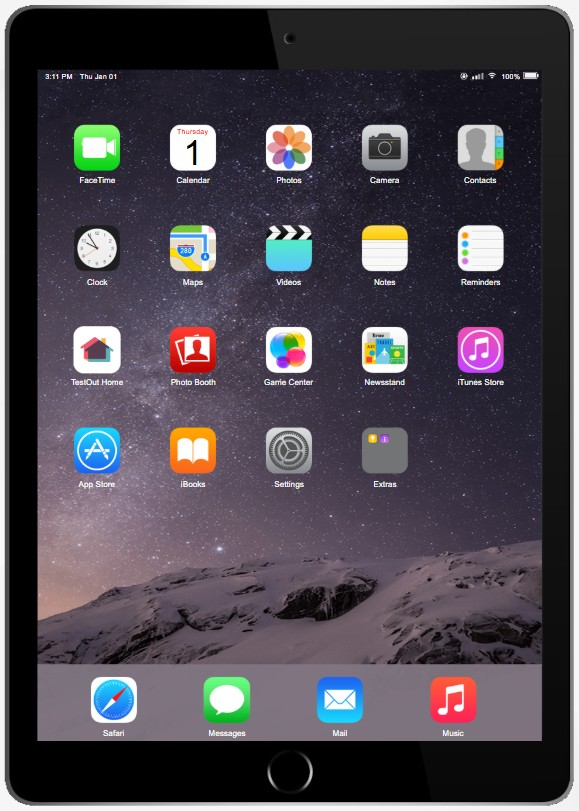
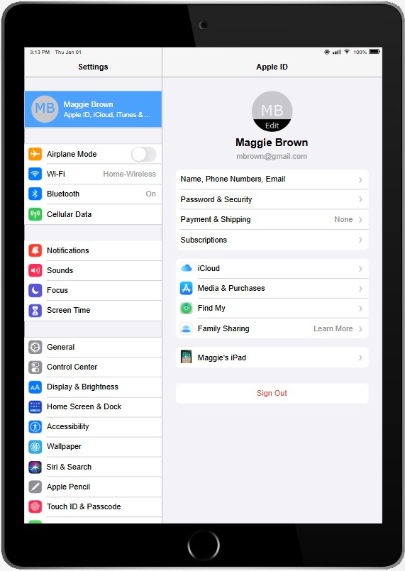
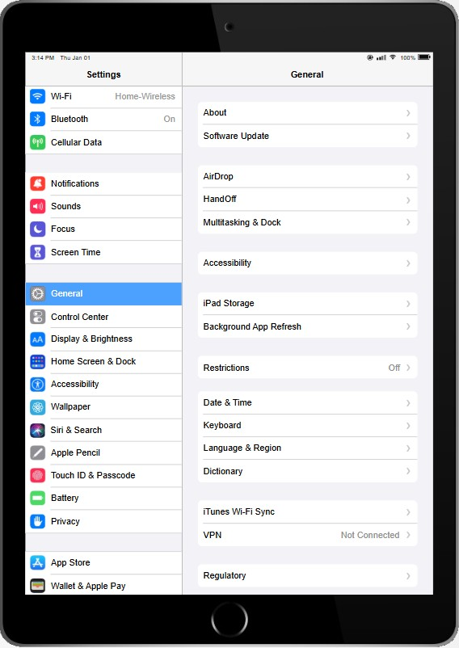
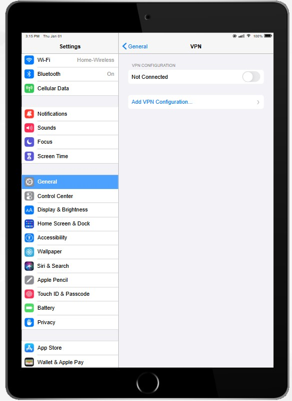
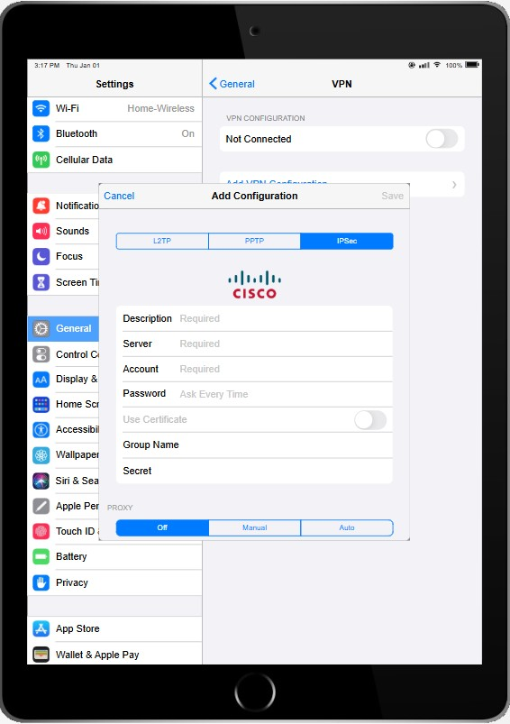
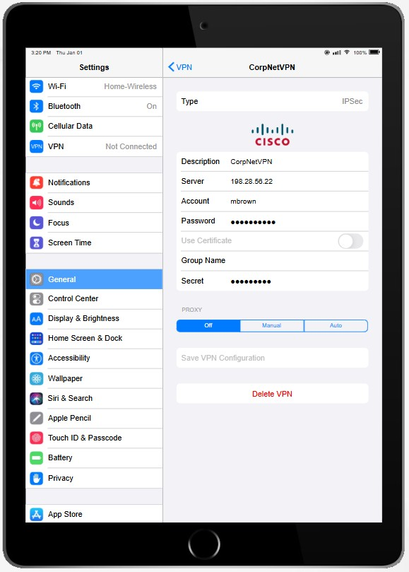
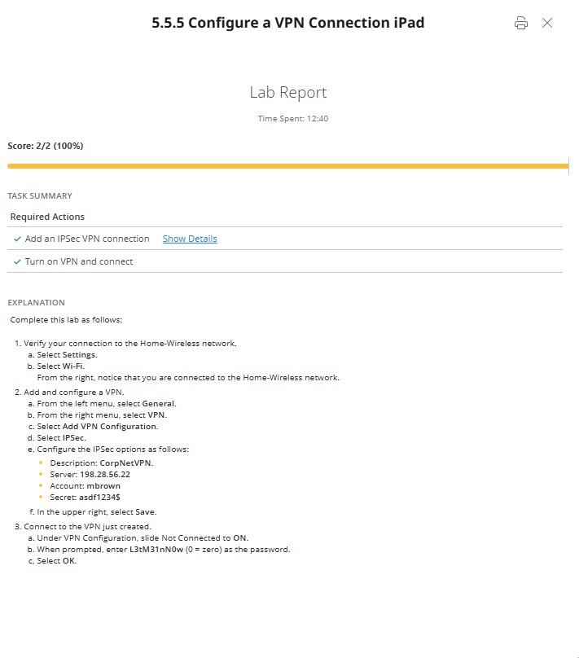

# 5.5.5 Configure a VPN Connection iPad
+ ในฐานะผู้ดูแลระบบรักษาความปลอดภัยด้านไอทีขององค์กรขนาดเล็ก คุณได้ดำเนินการตั้งค่า VPN สำหรับการเข้าถึงระยะไกลบนอุปกรณ์รักษาความปลอดภัยเครือข่ายเรียบร้อยแล้ว เพื่อให้ตัวเองและทีมผู้ดูแลระบบสามารถเข้าถึงเครือข่ายได้อย่างปลอดภัย ขณะนี้คุณอยู่ที่บ้านและต้องการนำ iPad มาเชื่อมต่อกับ VPN ผ่านเครือข่ายไร้สายที่บ้าน
+ วัตถุประสงค์ของการปฏิบัติในห้องปฏิบัติการนี้ มีดังนี้:
    + กำหนดค่าการเชื่อมต่อ VPN แบบ IPSec โดยใช้ข้อมูลดังต่อไปนี้

# วิธีเพิ่มการเชื่อมต่อ: Settings > General > VPN.

| Parameter |Value |
| :--- | :--- |
| **Description** | CorpNetVPN |
| **Server** | 198.28.56.22 |
| **Account** | mbrown |
| **Secret** | 	asdf1234$ |

+ เปิดใช้งานการเชื่อมต่อ VPN
+ ยืนยันว่าการเชื่อมต่อสำเร็จ โดยรหัสผ่านของ mbrown คือ L3tM31nN0w (0 = ศูนย์)

# Start Lab

  + 1.เริ่มต้นที่หน้า Home ของ iPad

  

  + 2.แตะที่ไอคอน Settings บนหน้า Home เพื่อเข้าสู่การตั้งค่า

  

  + 3.เลือกเมนู General เพื่อเข้าถึงการตั้งค่า VPN

  

  + 4.เลือก VPN ตามที่กำหนดในโจทย์

  

  + 5.กด Add Configuration แล้วเลือกประเภท IPSec ตามที่โจทย์ระบุ จากนั้นกรอกข้อมูลให้ครบถ้วน

  

  + 6.เมื่อกรอกข้อมูลครบแล้ว กด Save จากนั้นตรวจสอบข้อมูลที่บันทึกไว้ใน CorpNetVPN

  

  + 7.กด Connect เพื่อทดสอบการเชื่อมต่อ หากสำเร็จจะปรากฏสถานะ Connected ตามภาพ

  

  + 8.กด Score Lab เพื่อตรวจสอบผลและสิ้นสุด Lab 5.5.5 Configure a VPN Connection iPad

  
