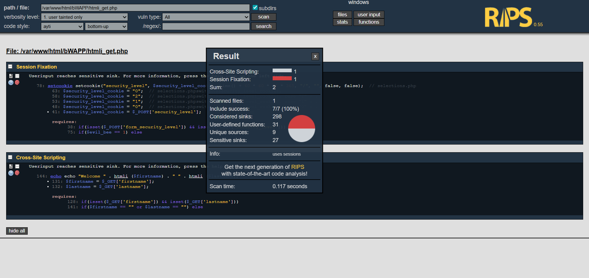
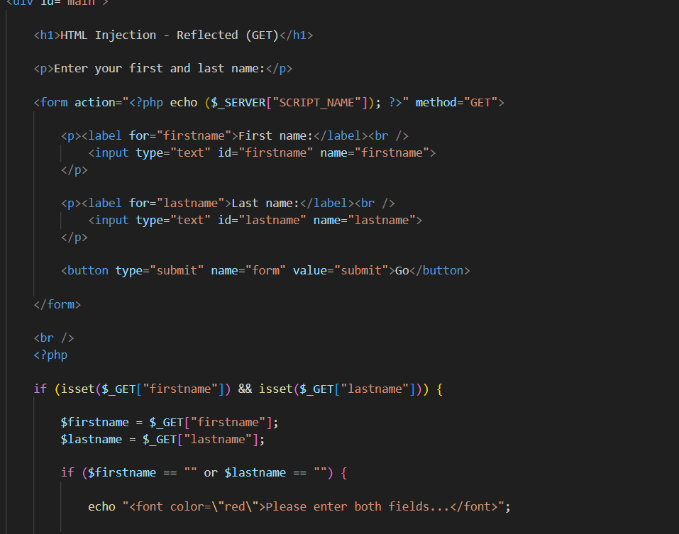
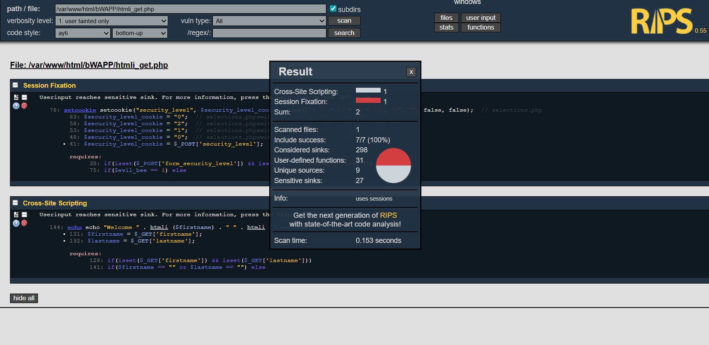

# ช่องโหว่ HTML Injection — Reflected (GET)
---------------------------------------------------------------------

## 1. ภาพรวมของระบบ

หน้าเว็บนี้เป็นส่วนหนึ่งของแอปพลิเคชัน **bWAPP** ในหัวข้อ **"HTML Injection — Reflected (GET)"** โดยมีหน้าที่รับข้อมูลชื่อ (First Name) และนามสกุล (Last Name) จากผู้ใช้ผ่านฟอร์ม แล้วนำค่าดังกล่าวมาแสดงผลบนหน้าเว็บด้วยข้อความ **"Welcome [firstname] [lastname]"**

เนื่องจากข้อมูลถูกส่งผ่าน **HTTP GET Parameter** ค่าที่ผู้ใช้กรอกจะปรากฏอยู่ใน URL ของเบราว์เซอร์โดยตรง


---

## 2. การวิเคราะห์และช่องโหว่ที่พบ

ระบบนี้มีจุดอ่อนที่เรียกว่า **HTML Injection — Reflected (GET)** สาเหตุมาจากการที่แอปพลิเคชันนำค่าจาก GET Parameter (`$_GET['firstname']` และ `$_GET['lastname']`) ไปแสดงผลบนหน้าเว็บโดยตรง โดยไม่มีการทำ Output Encoding หรือ Sanitization ใด ๆ

ส่งผลให้ผู้โจมตีสามารถแทรกโค้ด HTML หรือ JavaScript ลงในช่องกรอกข้อมูลได้ เมื่อ Server ประมวลผลและส่งผลลัพธ์กลับมา โค้ดดังกล่าวจะถูก Render ในเบราว์เซอร์ของเหยื่อทันที

**กระบวนการโจมตีมี 3 ขั้นตอน ดังนี้**

### ขั้นตอนที่ 1 — ทดสอบกรอกข้อมูลปกติ (Normal Input Test)

ผู้ใช้กรอกข้อมูลปกติ เช่น First Name = `test` และ Last Name = `user` แล้วกดปุ่ม **Go** ระบบจะแสดงข้อความ "Welcome test user" บนหน้าเว็บ โดยข้อมูลจะถูกส่งผ่าน URL ในรูปแบบ:

```
http://192.168.1.111/bWAPP/htmli_get.php?firstname=test&lastname=user&form=submit
```


---

### ขั้นตอนที่ 2 — แทรกโค้ด HTML ผ่าน GET Parameter (Inject Payload)

ผู้โจมตีแทรกโค้ด HTML ลงในช่อง First Name และ Last Name ผ่าน URL โดยตรง เช่น:

```
firstname=<h1>Hacked</h1>&lastname=
```

URL ที่ถูกดัดแปลงจะมีลักษณะดังนี้:

```http
GET /bWAPP/htmli_get.php?firstname=<h1>Hacked</h1>&lastname=&form=submit HTTP/1.1
Host: 192.168.1.111
User-Agent: Mozilla/5.0 ...
Accept: text/html,application/xhtml+xml,...
Connection: keep-alive
```


### ขั้นตอนที่ 3 — ผลจากการโจมตี (Attack Result)

เมื่อ Server ประมวลผลและส่งผลลัพธ์กลับมา โค้ด HTML ที่ถูกแทรกจะถูก Render ในเบราว์เซอร์ของเหยื่อ:

- **`<h1>Hacked</h1>`** — ข้อความ "Hacked" แสดงเป็นหัวข้อใหญ่บนหน้าเว็บ
- **``** — เรียกใช้ JavaScript ผ่าน Event Handler `onerror` ทำให้เกิด Pop-up Alert

ส่งผลให้ผู้โจมตีสามารถ:
- เปลี่ยนแปลงเนื้อหาหน้าเว็บ (Defacement)
- แทรกฟอร์มปลอมเพื่อหลอกเก็บข้อมูลของเหยื่อ (Phishing)
- รันสคริปต์ที่เป็นอันตราย เช่น ขโมย Cookie หรือ Session Token


---

## 3. การสแกนด้วยเครื่องมือ RIPS

นำไฟล์ `/var/www/html/bWAPP/htmli_get.php` เข้าสู่การวิเคราะห์ด้วย **RIPS Scanner** ผลลัพธ์ยืนยันการมีอยู่ของช่องโหว่ ได้แก่:

| ประเภทช่องโหว่ | จำนวนที่พบ | ไฟล์ที่เกี่ยวข้อง |
|---|---|---|
| Cross-Site Scripting (XSS) | 2 จุด | htmli_get.php |

**รายละเอียดที่ RIPS ตรวจพบ:**

- **บรรทัดที่ 19:** `echo $_GET['firstname'];` — แสดงผลข้อมูลจาก GET Parameter โดยตรง
- **บรรทัดที่ 20:** `echo $_GET['lastname'];` — แสดงผลข้อมูลจาก GET Parameter โดยตรง

**Tainted Source:** `$_GET['firstname']`, `$_GET['lastname']`
**Vulnerable Sink:** `echo` (แสดงผลโดยไม่มีการ Encode)



---

## 4. รายละเอียดช่องโหว่เพิ่มเติม — โค้ดต้นฉบับที่มีปัญหา

จากการตรวจสอบซอร์สโค้ดของไฟล์ `htmli_get.php` พบว่าระบบนำค่าจาก `$_GET` มาใช้แสดงผลโดยตรงผ่านคำสั่ง `echo` โดยไม่มีการป้องกันใด ๆ:

```php
<?php
// โค้ดที่มีช่องโหว่ (ก่อนแก้ไข)
$firstname = $_GET["firstname"];
$lastname  = $_GET["lastname"];

echo "Welcome " . $firstname . " " . $lastname;
// ไม่มี htmlspecialchars() = HTML Injection!
?>
```

> **ผลกระทบ:** ผู้โจมตีสามารถแทรกโค้ด HTML/JavaScript ใด ๆ ก็ได้ลงในหน้าเว็บผ่าน URL เมื่อเหยื่อคลิกลิงก์ที่ถูกดัดแปลง โค้ดจะถูก Execute ในบริบทของเหยื่อทันที (Reflected Attack)


---

## 5. แนวทางแก้ไขและเสริมความมั่นคงปลอดภัย (Patch Strategy)

การแก้ไขต้องดำเนินการเพื่อปิดช่องโหว่ได้อย่างครบถ้วน:

1. **Output Encoding**
   ใช้ `htmlspecialchars()` พร้อมพารามิเตอร์ `ENT_QUOTES` และ `UTF-8` เพื่อแปลงอักขระพิเศษ เช่น `< > " ' &` ให้เป็น HTML Entities (เช่น `&lt;` หรือ `&quot;`) วิธีนี้ป้องกันไม่ให้โค้ด HTML/JavaScript ที่ถูกแทรกทำงานในเบราว์เซอร์

2. **Input Validation**
   ตรวจสอบและจำกัดรูปแบบข้อมูลขาเข้า เช่น อนุญาตเฉพาะตัวอักษร ตัวเลข และช่องว่าง โดยปฏิเสธอักขระพิเศษที่ใช้ในการสร้าง HTML Tag

3. **Content Security Policy (CSP)**
   กำหนด HTTP Response Header `Content-Security-Policy` เพื่อจำกัดแหล่งที่มาของสคริปต์ที่อนุญาตให้ทำงานบนหน้าเว็บ เป็นการเสริมชั้นป้องกันเพิ่มเติม (Defense in Depth)

---

## 6. การแก้ไขโค้ดจริง

ดำเนินการแก้ไขในไฟล์ `htmli_get.php` ที่ path `/var/www/html/bWAPP/` ดังนี้:

- **เปลี่ยนวิธีแสดงผล:** ครอบค่าจาก `$_GET['firstname']` และ `$_GET['lastname']` ด้วยฟังก์ชัน `htmlspecialchars()` ก่อนส่งออกด้วย `echo`
- **เพิ่มพารามิเตอร์:** ใช้ `ENT_QUOTES` เพื่อ Encode ทั้งเครื่องหมาย Single Quote และ Double Quote รวมถึงระบุ Charset เป็น `UTF-8`

```php
<?php
// โค้ดที่แก้ไขแล้ว (หลังแพตช์)
$firstname = $_GET["firstname"];
$lastname  = $_GET["lastname"];

echo "Welcome " . htmlspecialchars($firstname, ENT_QUOTES, "UTF-8")
     . " " . htmlspecialchars($lastname, ENT_QUOTES, "UTF-8");
// HTML tags จะถูกแปลงเป็น &lt; &gt; entities แทน
?>
```



---

## 7. การทดสอบหลังแพตช์ (Regression & Security Test)

สแกนซ้ำด้วย RIPS พบว่าจำนวนช่องโหว่ลดลงเหลือ **0 รายการ** เนื่องจากทุกจุดที่แสดงผลข้อมูลจากผู้ใช้ได้รับการ Encode แล้ว


ทดสอบการโจมตีซ้ำด้วยวิธี HTML Injection:

- กรอก `<h1>Hacked</h1>` ลงในช่อง First Name แล้วกดปุ่ม Go
- แม้ว่า URL จะยังมี Payload อยู่ แต่ระบบที่แก้ไขแล้วจะแสดงข้อความ **`<h1>Hacked</h1>`** เป็นข้อความธรรมดา (Plain Text) แทนที่จะ Render เป็น HTML

ตรวจสอบผลลัพธ์:

- ข้อความ `<h1>Hacked</h1>` แสดงเป็นตัวอักษรบนหน้าเว็บ ไม่ถูก Render เป็นหัวข้อ
- Tag `` ไม่ถูก Execute — ไม่มี Pop-up Alert เกิดขึ้น
- View Source แสดงค่าเป็น `&lt;h1&gt;Hacked&lt;/h1&gt;` ยืนยันว่า Encoding ทำงานถูกต้อง



---

## สรุป

> **การปรับปรุงโค้ดครั้งนี้สามารถปิดช่องโหว่ HTML Injection — Reflected (GET) ได้อย่างครบถ้วน โดยการใช้ `htmlspecialchars()` ครอบทุกจุดที่แสดงผลข้อมูลจากผู้ใช้ ระบบยังคงรองรับการกรอกชื่อและนามสกุลได้ตาม Business Function เดิมทุกประการ โดยที่โค้ด HTML/JavaScript ที่ถูกแทรกจะไม่สามารถทำงานได้อีกต่อไป**
